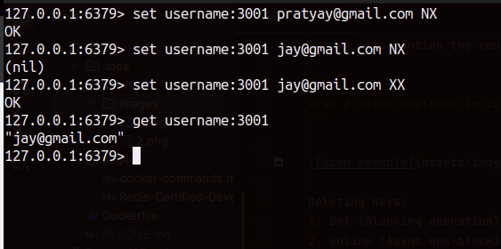

## Redis Certified Developer Program ##

Click [here]() to know more about the exam.

### Redis University ###

Handy [docker](pages/docker-commands.md) commands 

#### Installation of Redis ####

Running a redis container:

```bash
docker run --name <container_name> -d redis
```

Launch the redis container:

```bash
docker exec -it <container_name> redis-cli
```

Accessing the **redis.conf** file to modify the properties of your redis server.

1. Create a Dockerfile and paste the following contents
    ```Dockerfile
    FROM redis:latest
    COPY redis.conf /usr/local/etc/redis/redis.conf
    CMD ["redis-server", "/usr/local/etc/redis/redis.conf"]
    ```

    ```bash
    docker exec -it <container_name> cat /usr/local/etc/redis/redis.conf
    ```

### RU101 ###

Data Structures:

**Chapter 1:** Keys and Expiration
      
defining a key:
 
```
 set customer:1000 fred
 get customer:1001 roy
```
Getting all the existing keys in redis database -

We have two methods `KEYS` & `SCAN`
 
Disadvantages of using keys command
* Blocks until complete.
* It is never preferred to use in production.

 **Example:** 
   ```
     keys customer:1*
   ```
This will retrieve the keys that start with id 1.


**Scan command:**

scan {slot_value} match customer:1*

It will return a slot value available for next operation.

```
scan 0 match customer:1*
```

We can also mention the count to specify the number of records to be retrieved.

```
scan 2 match customer:1* count 5
```


Deleting keys:
1. Del (Blocking operation)
2. Unlink (Async non-blocking command)

Example :

```
unlink customer:1000
```

Exists command - to check if the key already exists and then set the value.

```
exists customer:100:Pratyay
```

Setting the value of the key only if the value exists:

```
set customer:2000 pratyay NX
set customer:2000 jay XX
```

**Note :**

In the second line the value will only be set if the key exists.

Again, NX is used to set if the key does not exist set the key value.




